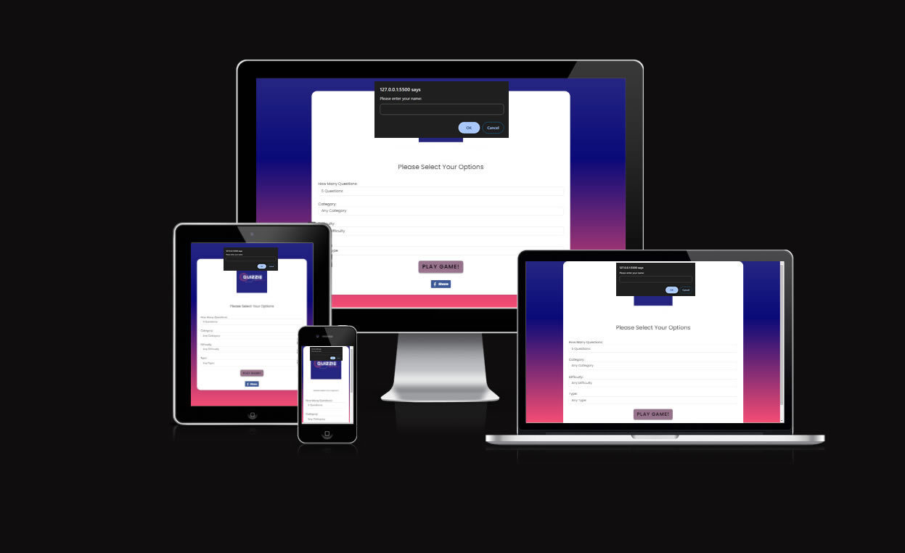
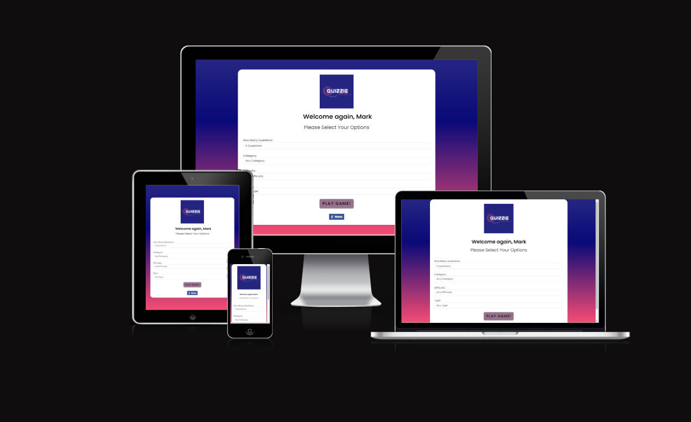
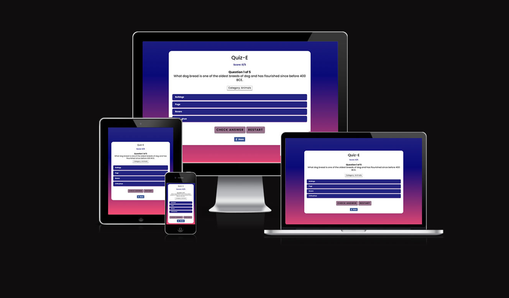
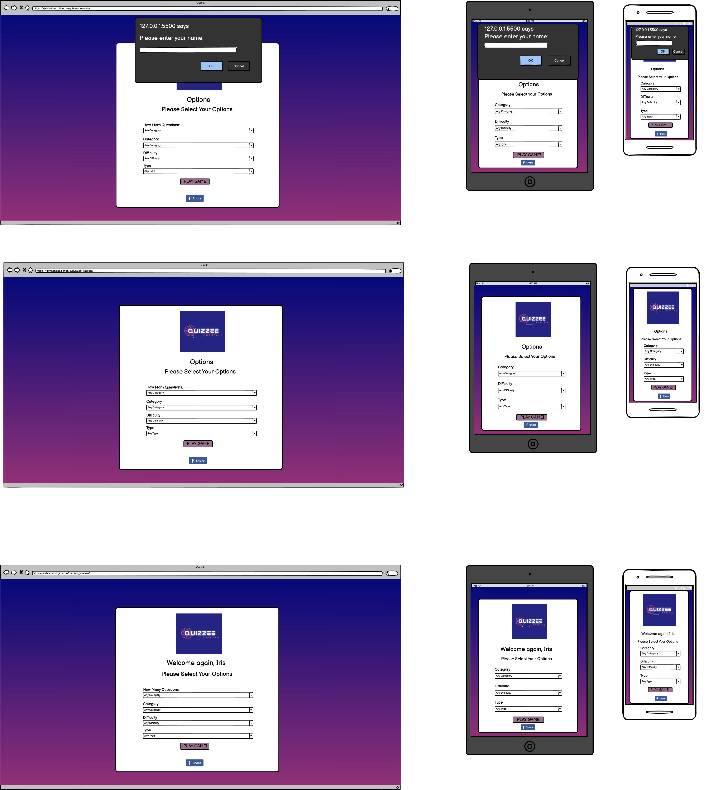
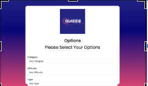
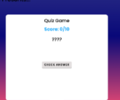
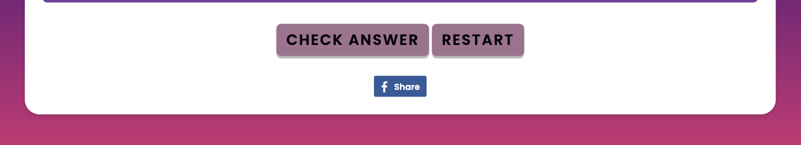
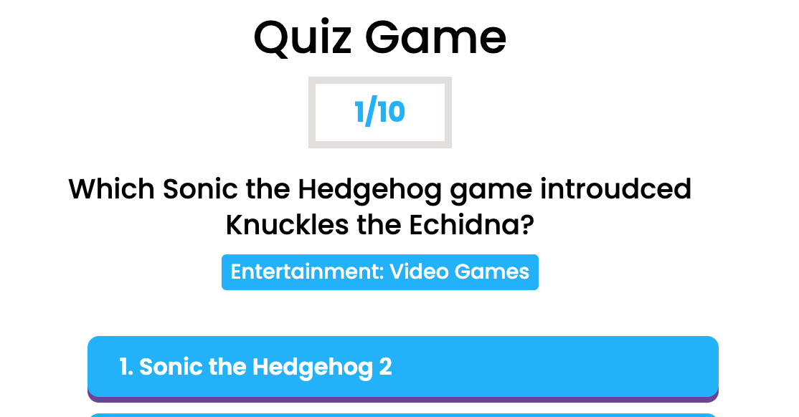

<h1>Quiz-E by Quizzie Rascals README.MD</h1>

<h2>Introduction</h2>

Quiz-E by Quizzie Rascals is an online quiz designed to allow users to test their general and subject-specific knowledge. It encourages replayability and ensures a broad target audience (age 13+), by offering the user the chance to vary difficulty, quiz length, and subject matter. It also provides the option to share Quiz-E with friends and family on social media.

## Landing page for first time users

The landing page allows users to provide their name so that they are greeted by name on return visits to personalise and improve user engagement.

<strong>Landing page for first time users</strong>

## Options page (landing page for returning users) 

The Options page allows users to provide their name so that they are greeted by name on return visits. 

There are drop menus to adjust difficulty, category, how many questions, and question type. There is also a social media button to easily share Quiz-E. 

It displays the Quizzie Rascals brand logo clearly for brand recognition. It also provides the option to share Quiz-E with friends and family on social media.

<strong>Options page across multiple devices</strong>

 

<strong>Quiz length dropdown menu</strong>
 

 

<strong>Quiz subject dropup menu</strong>

 

<strong>Quiz subject difficulty menu</strong>

 

<strong>Quiz type difficulty menu</strong>

 ## Quiz page

 The quiz page presents questions and possible answers, with buttons clearly delineated against their background. 
 
 There is clear feedback when a user selects and then commits an answer. 
 
 It lets you know the correct answer if you were wrong. There is also an updating score display. 

 There is a restart button in case the user decides they want to start again. 

<strong>In-quiz page across multiple devices</strong>

<strong>Mid-quiz page showing answer committed and feedback provided</strong>

<strong>Quiz complete screen</strong>

## Design Choices

We selected a rich and colourful style, using bright high contrast colours. We want the user to feel immersed in the experience of visiting our website. We derived our colours from https://visme.co/blog/website-color-schemes/
“Bright Accent Colors”
#242582
#553D67
#F64C72
#99738E
#2F2FA2

We selected the font style Poppins 'https://fonts.googleapis.com/css2?family=Poppins:wght@300;400;500;600;700;800;900&display=swap'. It works well as a fun, slightly futuristic, slightly unusual font; but not unusual enough to overpower the rest of the page.

## Wire Frames

<strong>Landing page for First Time User followed by Options Pages for repeat users </strong>

## Quiz page

We ensured that we provided wireframes to cover all the different stages of user experience and features

## User Stories, features and bugs

<table>
  <tr>
    <th>User Story</th>
    <th>Features</th>
    <th>Bugs / Issues - tested across viewports of all devices using Google Dev Tools</th>
  </tr>
   <tr>
    <td>As a user, I want a flowing, integrated user experience. </td>
    <td>No bugs or issues that make interaction with site feel awkward</td>
    <td>1. Three second delay between selecting answer and next question  
    2. On large devices the "Enter name" box obscures the brand logo and feels like a pop-up rather than an integrated element of the UX package</td>
   
    
  </tr>
  <tr>
    <td>As a user, I want the questions and answers to be clear and unambiguous.</td>
    <td>Questions clearly phrased. Text clearly delineated against background.</td>
    <td>Occasional spelling errors e.g. "Introduced" spelt 'introudced'.</td>
  
  </tr>
   <tr>
    <td>As a site owner, I want the logo clearly visible to increase brand recognition.</td>
    <td>Logo clearly visible on landing/options page.</td>
    <td>On first visit then "Enter Name" box covers brand logo on some devices</td>
  <tr>
    <td>As a user, I want it to be obvious how to proceed with the game.</td>
    <td>Questions, and answer list clear, with feedback when answers clicked.</td>
    <td>None detected</td>
  </tr>
  <tr>
    <td>As a user, I want to be able to restart the game once I’ve finished.</td>
    <td>Play again button at bottom of page when quiz complete</td>
    <td>None deteced</td>
    
  </tr>
  <tr>
    <td>As a user, I want to be able to reset the game when I’ve made an error.</td>
    <td>Reset / restart quiz button</td>
    <td>None detected</td>
    
  </tr>
  <tr>
    <td>As a user, I want the site to be easily navigable.</td>
    <td>Different features of site are clearly identifiable</td>
    <td>None detected</td>
    
  </tr>
  <tr>
    <td>As a user, I want to be able to choose an answer from a pre-populated list.</td>
    <td>List of answers to be selected</td>
    <td>None detected</td>
    
  </tr>
  <tr>
    <td>As a user, I want to receive feedback on the answers.</td>
    <td>Clear signal of correct / incorrect answer</td>
    <td>None detected</td>
    
  </tr>
  <tr>
    <td>As a user, I want the site to be visually appealing.</td>
    <td> Select complementary colour scheme.  
    Different elements/features delineated.</td>
    <td>None detected</td>
    
  </tr>
  <tr>
    <td>As a user, I want to be able to start the quiz.</td>
    <td>Page loads and includes necessary event listeners</td>
    <td>None detected</td>
    
  </tr>
   <tr>
    <td>As a site owner, I want to use an API so that I can source questions from an outside repository.</td>
    <td>Questions load clearly in each different category and difficulty</td>
    <td>Sometimes quiz repeats questions, or includes them from higher difficulties.</td>
    
  </tr>
      <td>As a user, I want to sort the questions by categories so I can test myself on specific topics.</td>
    <td>Drop-down menu specifying topic category</td>
    <td>None detected</td>
    <tr>
      <td>As a user I want to challenge myself against different degrees of difficulty depending on my level of knowledge</td>
    <td>Drop-down menu specifying difficulty level</td>
    <td>Sometimes quiz repeats questions, or includes them from higher difficulties.</td>
    </tr>
    <tr>
    <td>As a user, I want to be greeted by name when I enter the website for personalisation and to feel welcome.</td>
    <td>Input Name field and have name saved when user returns (cookies required)</td>
    <td>None detected</td>
  </tr>
     <tr>
    <td>As a user I want to see my score</td>
    <td>Current score display to keep score updating</td>
    <td>None detected</td>
  </tr>
    <tr>
    <td>As a user I want to be able to share the fun I am having doing the quiz, and challenge my friends.</td>
    <td>"Share with friends" copy link button. Post to FB / Instagram / X clickable icons.</td>
    <td>Ran out of time to add Instagram and X icons</td>
  </tr>
    <tr>
     <td>As a site owner I want to increase the visibility and thus usership of our website.</td>
    <td>"Share with friends" copy link button. Post to FB / Instagram / X clickable icons.</td>
    <td>Ran out of time to add Instagram and X icons</td>
  </tr>
    <tr>
     <td>As a user, I want to be able to adjust the number of questions I am asked to try shorter or longer games.</td>
    <td>Dropdown menu providing game length options</td>
    <td>Sometimes quiz repeats questions, or includes them from higher difficulties.</td>
  </tr>
  </table>

 

### User Stories and Features (to be implelemented next Sprint) 

  <table>
  <tr>
    <th>User Story</th>
    <th>Features</th>
    <th>Bugs / Issues</th>
  </tr>

  <tr>
    <td>As a user I want to be able to store my highest score to see if I can beat it on my future visits.</td>
    <td>Highest score from previous use visible (cookies required)</td>
    <td>N/A</td>
  </tr>
  

  </table>

### Won't haves

  <table>
  <tr>
    <th>User Story</th>
    <th>Features</th>
    <th>Bugs / Issues</th>
  </tr>
  <tr>
    <td>As a user, I want to have a countdown timer to challenge myself to answer more quickly.</td>
    <td>A countdown timer to display either how long I have left to answer the question before it assigns to wrong</td>
    <td>N/A</td>
  </tr>
    
 
  <td>As a site-owner I want to have a questions backup in case the API  stops working.</td>
    <td>A secondary API or source of questions in case the first API breaks down</td>
    <td>N/A</td>
  </table>

## Fixed Bugs / Issues
 
<table>
  <tr>
    <th>Bug/Issue</th>
    <th>Image</th>
    <th>Resolution</th>
  </tr>
  <td>"Select type" option overflows to below options box on smaller devices</td>
    <td></td>
    
  <td>We added media queries to ensure effective responsiveness</td>
  </tr>
      
  </tr>
    <td>Quiz-E would display without questions and just show questions marks when user left all questions to default(i.e.Any).</td>
   <td></td>
   <td>We required the user to enter Questions Length, and API call modified to accommodate this by leaving the “any” option off the API call.</td>
  </tr>
      
  </tr>
    <td>Sometimes after answering several questions the questions would stop changing</td>
   <td></td>
    
  <td>The problem lay was that when too many requests were made from the API in too small a space of time. Therefore to fix this we implemented a required delay of three seconds between committing answers</td>
  </tr>
  </table>

## Unfixed Bugs / Issues
 
<table>
  <tr>
    <th>Bug/Issue</th>
    <th>Image</th>
    <th>Resolution</th>
  </tr>
  <td>On large devices the "Enter name" box obscures the brand logo and feels like a pop-up rather than an integrated element of the UX package</td>
    <td></td>
    
  <td>Unfortunately we ran out of time to fix this. We would in future sprints change from an in-browser alert box to a html modal box, that would be styled and centred on the screen etc as part of a user management system.</td>
  </tr>
      
  </tr>
    <td>Sometimes quiz repeats questions, or includes them from higher difficulties. As an example of both, this question came up twice in a quiz set to easy.</td>
    <td></td>
    
  <td>Unfortunately none available as source of questions is the API. The only fix would have been to change the API from a paid provider but this would be costly and we would have had to change too much code by the time we realised</td>
  </tr>
    
  </tr>
  <td>Three second delay between answer and next question</td>
    <td></td>
    <td>The delay was a fix to a bug of the site crashing when too many requests were made from the API in too small a space of time(see "Fixed Bugs" above). The only fix would have been to change the API from a paid provider but this would be costly and we would have had to change too much code by the time we realised</td>
      <tr>
      <td>Only a share to FB button, no instagram or X buttons</td>
       
    <td></td>
    <td> <br Ran out of time to add this sprint, but definitely would be added Instagram and X buttons on a future sprint  </td>
  </tr>
  <tr>
      <td>Spelling errors on website </td>
    <td></td>
    <td>Unfortunately none available as source of questions is the API. The only fix would have been to change the API from a paid provider.</td>
    
    
  <table>
  
  </tr>

  </table>

### Validator Testing 

For HTML validation https://validator.w3.org/

For CSS validation  https://jigsaw.w3.org/css-validator/

  

## Deployment

Site successfully deployed on https://kjwhitehead.github.io/quizzee_rascals/

## Credits 

Color Scheme: “Bright Accent Colors” https://visme.co/blog/website-color-schemes/

### Content 

Timer used to display delay issue https://www.online-stopwatch.com/

Responsiveness displayed on https://ui.dev/amiresponsive

API Questions taken from https://opentdb.com/

Code initially inspired by and re-written https://opentdb.com/

Logo from Canva https://www.canva.com/

For validation in HTML https://validator.w3.org/

For validation in CSS https://jigsaw.w3.org/css-validator/

For ReadME table https://www.shecodes.io/athena/2362-creating-a-table-with-4-columns-and-4-rows-in-html

Wireframes produced using Balsamiq WireFrames https://balsamiq.com/wireframes/?gad_source=1&gclid=CjwKCAiA44OtBhAOEiwAj4gpOexFh0z3peWS6wolbjlJt_fLq7cZGNu99YeMSIpU89wlL2p6ZluXiRoCOSUQAvD_BwE

Timer used to display delay issue https://www.online-stopwatch.com/

## Other General Project Advice

Enjoy the Quiz!

